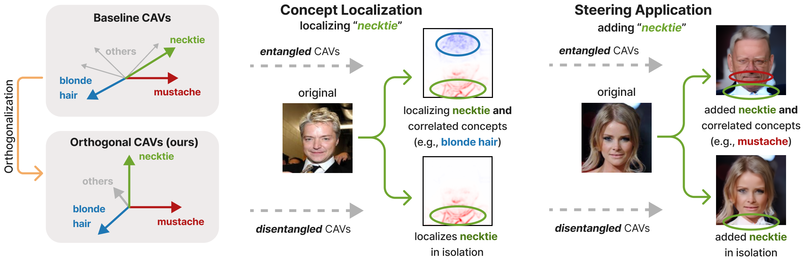

<div align="center">
<h1>Post-Hoc Concept Disentanglement: From Correlated to Isolated Concept Representations</h1>

[](https://www.python.org/) &nbsp;&nbsp; [](https://pytorch.org/)
</div>

## Description
This repository provides the codebase for **Post-Hoc Concept Disentanglement**. It includes CAV training, orthogonalization, disentanglement metrics, localization visualizations, and downstream evaluations such as activation steering and model correction. Experiments are configurable via Hydra in `configs/`, with primary entry points in `experiments/` and sweep scripts in `scripts/`.

**Abstract**<br>

Concept Activation Vectors (CAVs) are widely used to represent human-understandable concepts as directions in the latent space of neural networks. They are typically learned by contrasting activations of concept samples against non-concept samples. However, when concepts are correlated in the data, this procedure often yields highly aligned, non-orthogonal directions. For example, concepts such as "Wearing Necktie" and "Mustache" in the CelebA dataset frequently co-occur, making them difficult to interpret and manipulate in isolation. Such concept entanglement complicates concept-based explanations and can lead to unintended side effects in downstream applications such as activation steering and model correction.

In this thesis, we study concept disentanglement from a geometric perspective and propose orthogonality between concept representations as a principled notion of disentanglement. We first show, analytically and via a controlled toy experiment, that jointly learned multi-Pattern CAVs implicitly promote orthogonalization under idealized assumptions. We then demonstrate that similar implicit disentanglement emerges in realistic settings without explicit constraints, particularly on real-world data with strong concept correlations, supported by quantitative and qualitative analyses.

To further reduce residual entanglement, we introduce an explicit post-hoc disentanglement method based on non-orthogonality penalization. This approach enables controlled and, when desired, perfect orthogonalization of concept directions while largely preserving directional correctness. Finally, we evaluate disentangled concept representations in practical steering applications, demonstrating that orthogonalized concepts enable (1) the insertion of isolated concepts into input images through generative models and (2) the removal of spurious shortcut concepts for model correction with reduced collateral damage. Overall, this thesis provides a unified framework for understanding, measuring, and enforcing concept disentanglement in neural networks, and highlights its importance for reliable and controllable concept-based interventions.



## Table of Contents
- [Description](#description)
- [Table of Contents](#table-of-contents)
- [Installation](#installation)
- [Extracting Latent Activations](#extracting-latent-activations)
- [Training / Fine-tuning CAVs](#training--fine-tuning-cavs)
- [Running Experiments](#running-experiments)
- [Extracting Heatmaps (for CelebA only)](#extracting-heatmaps-for-celeba-only)
- [Alternative: Jupyter Notebook](#alternative-jupyter-notebook)

## Installation
1. Clone this repository:
   ```bash
   git clone https://github.com/erenerogullari/cav-disentanglement.git
   ```

2. Navigate to the repository folder:
   ```bash
   cd cav-disentanglement
   ```

3. We use Python 3.11.10. To install the required dependencies, run:
   ```bash
   pip install -r requirements.txt
   ```

## Extracting Latent Activations
Latent activations are extracted internally by the main experiments and cached under `variables/` for reuse.
To control what gets extracted, edit the dataset/model configuration used by the experiment you run.

1. Place a compatible checkpoint under `checkpoints/` (e.g., `checkpoints/checkpoint_{model}_{dataset}.pth`).
2. Configure dataset/model/cav parameters in `configs/cav_disentanglement.yaml` or `configs/model_correction.yaml`.
3. Run an experiment (see below). Activations and labels will be cached automatically.

## Training / Fine-tuning CAVs
The main CAV training + disentanglement pipeline is in `experiments/run_cav_disentanglement.py`.
It trains CAVs and (optionally) runs localization/colocalization visualizations.

1. Adjust `configs/cav_disentanglement.yaml`:
   ```yaml
   train:
     learning_rate: 0.0001
     num_epochs: 200
     val_ratio: 0.1
     test_ratio: 0.1
     random_seed: 42

   cav:
     cav_mode: max
     layer: features.28
     alpha: 0.1
     beta: null
     target_concepts: []
     optimal_init: false
     exit_criterion: orthogonality
   ```
2. Run the experiment:
   ```bash
   python -m experiments.run_cav_disentanglement cav.alpha=0.1 cav_model@cav=pattern_cav
   ```
3. For sweeps, use the helper script:
   ```bash
   bash scripts/run_cav_disentanglement.sh
   ```

## Running Experiments
This repository contains three primary experiment entry points. All use Hydra configs in `configs/` and accept CLI overrides.

1. **CAV disentanglement** (training + localization)
   ```bash
   python -m experiments.run_cav_disentanglement cav.alpha=0.1 cav_model@cav=pattern_cav
   ```

2. **Activation steering (DiffAE)**
   ```bash
   python -m experiments.run_activation_steering dir_model.alpha=1 cav_model@dir_model=pattern_cav
   ```
   Sweep alphas via:
   ```bash
   bash scripts/run_activation_steering.sh
   ```

3. **Model correction**
   ```bash
   python -m experiments.run_model_correction cav.alpha=0.1 cav_model@cav=multi_cav
   ```
   Sweep alphas via:
   ```bash
   bash scripts/run_model_correction.sh
   ```

4. **COCO Dining-6 concept leakage**

   Install `pycocotools`, download the official COCO 2017 images and instance
   annotations, and expose the root directory through `COCO_ROOT`:

   ```bash
   export COCO_ROOT=/path/to/coco
   python -m experiments.run_concept_leakage cav.alpha=0.1
   # Or run the default CAV-type/alpha sweep:
   bash scripts/run_concept_leakage.sh
   ```

   The root must contain `train2017/`, `val2017/`,
   `annotations/instances_train2017.json`, and
   `annotations/instances_val2017.json`. The default PoC uniformly samples
   10,000 training images and evaluates at most 100 positive validation images
   per Dining-6 concept.

### Local configuration for concept leakage

`configs/` is intentionally ignored in this repository. Create these local
Hydra files before running the experiment (the implementation does not require
machine-specific paths in tracked files).

`configs/concept_leakage.yaml`:

```yaml
defaults:
  - hardware@train: local
  - dataset: coco
  - model: vgg16_ssd_coco
  - cav_model@cav: pattern_cav
  - _self_

experiment:
  name: concept_leakage
  out: results/${experiment.name}/${dataset.name}_${dataset.concept_set}/${model.name}_${cav.layer}/${cav.name}/epochs${train.num_epochs}_train${dataset.max_samples}_subsetseed${dataset.subset_seed}/seed${train.random_seed}

train:
  learning_rate: 0.0001
  num_epochs: 200
  val_ratio: 0.1
  test_ratio: 0.0
  random_seed: 42

cav:
  cav_mode: max
  layer: features.28
  alpha: 0.1
  beta: null
  target_concepts: []
  optimal_init: false
  exit_criterion: null

evaluation:
  device: ${train.device}
  batch_size: ${train.batch_size}
  split: val2017
  max_samples_per_concept: 100
  overlays_per_concept: 5
  random_seed: ${train.random_seed}
```

`configs/dataset/coco.yaml`:

```yaml
_target_: datasets.get_coco_dataset
name: coco
data_paths: ["${oc.env:COCO_ROOT}"]
normalize_data: true
image_size: 300
split: train2017
concept_set: dining6
concepts: null
max_samples: 10000
subset_seed: 42
```

For another concept set, override `dataset.concepts` with category names and
set `dataset.concept_set=custom` so the result directory remains distinct.

`configs/model/vgg16_ssd_coco.yaml`:

```yaml
name: vgg16_ssd_coco
n_class: null
pretrained: true
ckpt_path: null
```

Create `configs/hardware/local.yaml` with `device`, `num_workers`, and
`batch_size` (the PoC default is batch size 16). Create the five CAV configs as:

```yaml
# configs/cav_model/pattern_cav.yaml
_target_: cav_models.PatternCAV
name: pattern_cav

# Replace both values for the remaining files:
# cav_models.MultiPatternCAV / multi_cav
# cav_models.SvmCAV          / svm_cav
# cav_models.LogCAV          / log_cav
# cav_models.RidgeCAV        / ridge_cav
```

Each run saves final-epoch CAVs, per-image localization and leakage CSVs,
directed leakage/count matrices, a leakage figure, and deterministic example
overlays under `results/concept_leakage/`.

Results are written to `results/{experiment.name}/...` as specified in the corresponding config file.

## Extracting Heatmaps
Heatmaps are generated as part of the CAV disentanglement, model correction,
and COCO concept-leakage pipelines.
To enable or customize them, adjust the localization/heatmap settings in the relevant config.

1. Update localization settings in `configs/cav_disentanglement.yaml` or heatmap settings in `configs/model_correction.yaml`.
2. Run either `experiments.run_cav_disentanglement` or `experiments.run_model_correction`.
3. Outputs are stored under the experiment’s `results/` directory.

## Alternative: Jupyter Notebook
Alternatively, one can go over the content in `cav_disentanglement.ipynb` to get an overview of the method without running the scripts.
