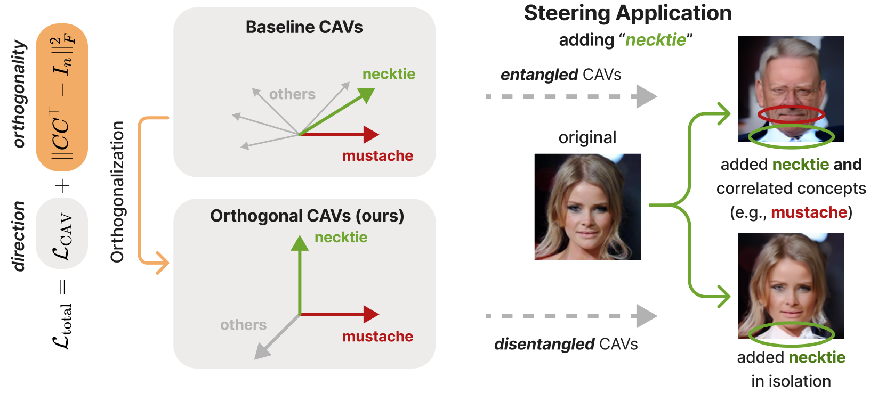

# <p align="center">Post-Hoc Concept Disentanglement: From Correlated to Isolated Concept Representations</p>
<p align="center">PyTorch Implementation</p>

## Description
This repository provides tools to train and analyze Concept Activation Vectors (CAVs) under orthogonality constraints designed to encourage disentanglement among concepts. It includes training scripts, metrics, and visualizations to evaluate disentanglement performance. For more details about the method please see the paper **"Post-Hoc Concept Disentanglement: From Correlated to Isolated Concept Representations"**. 

**Abstract**<br>
Concept Activation Vectors (CAVs) are widely used to model human-understandable concepts as directions within the latent space of neural networks. They are trained by identifying directions from the activations of concept samples to those of non-concept samples. However, this method often produces similar, non-orthogonal directions for correlated concepts, such as ''beard'' and ''necktie'' within the CelebA dataset, which frequently co-occur in images of men. This entanglement complicates the interpretation of concepts in isolation and can lead to undesired effects in CAV applications, such as activation steering.
To address this issue, we introduce a post-hoc concept disentanglement method that employs a non-orthogonality loss, facilitating the identification of orthogonal concept directions while preserving directional correctness. We evaluate our approach with real-world and controlled correlated concepts in CelebA and a synthetic FunnyBirds dataset with VGG16 and ResNet18 architectures. We further demonstrate the superiority of orthogonalized concept representations in activation steering tasks, allowing (1) the *insertion* of isolated concepts into input images through generative models and (2) the  *removal* of concepts for effective shortcut suppression with reduced impact on correlated concepts in comparison to baseline CAVs.



## Table of Contents
- [Post-Hoc Concept Disentanglement: From Correlated to Isolated Concept Representations](#post-hoc-concept-disentanglement-from-correlated-to-isolated-concept-representations)
  - [Description](#description)
  - [Table of Contents](#table-of-contents)
  - [Installation](#installation)
  - [Extracting Latent Activations](#extracting-latent-activations)
  - [Training / Fine-tuning CAVs](#training--fine-tuning-cavs)
  - [Extracting Heatmaps (for CelebA only)](#extracting-heatmaps-for-celeba-only)

## Installation
1. Clone this repository:
   ```bash
   git clone https://github.com/erenerogullari/cav-disentanglement.git
   ```

2. Navigate to the repository folder:
   ```bash
   cd cav-disentanglement
   ```

3. We use Python 3.11.10. To install the required dependencies, run:
   ```bash
   pip install -r requirements.txt
   ```


## Extracting Latent Activations
1. Add the pre-trained model checkpoint under `checkpoints/checkpoint_{model}_{dataset}.pth`. Checkpoints used in the paper can be found [here](https://drive.google.com/drive/folders/1Vv_Dq-1hDcYl-A-TuXNH8jRDKe9-BR-k?usp=sharing).
2. Specify the dataset and model configuration in `configs/extract_latents/config.yaml`:
   ```yaml
   dataset:
    dataset: "celeba"   # or "funnybirds_attributes"
    path: "path_to_dataset"
    img_size: 224

   model:
      model: "vgg16"
      layer: "features.28"
      cav_mode: "max"
    n_class: 2
   ```
3. Run the script `scripts/extract_latents.py` via:
   ```bash
    python -m scripts.extract_latents
   ```

## Training / Fine-tuning CAVs
1. To train or fine-tune CAVs adjust the configurations in `configs/train_cavs/config.yaml`:
   ```yaml
    train:
      learning_rate: 0.001
      num_epochs: 200
      batch_size: 32
      train_ratio: 0.9
      random_seed: 42
      num_workers: 0
      device: "cuda"

    cav:
      alpha: 0.1
      beta: null            
      n_targets: 50     
      optimal_init: true

    paths:
      latents: "variables/latents.pt"
      labels: "variables/labels.pt"
      concept_names: "variables/concept_names.pkl"
   ```
2. Run the script with the following command:
   ```bash
    python -m scripts.train_cavs 
   ```

## Extracting Heatmaps (for CelebA only)
1. To extract heatmaps for the optimized CAVs adjust the configurations in `configs/extract_heatmaps/config.yaml`:
   ```yaml
    dataset:
      dataset: "celeba"
      path: "path_to_dataset"
      img_size: 224

    model:
      model: "vgg16"
      layer: "features.28"
      n_class: 2

    attribution:
      device: "cuda"
      random_seed: 42
      n_samples_each: 5
      composite:
        _target_: zennit.composites.EpsilonPlusFlat

    cavs:
      path: "results/cavs:alpha0.1_lr0.001"
   ```
2. Run the script with the following command:
   ```bash
    python -m scripts.extract_heatmaps
   ```